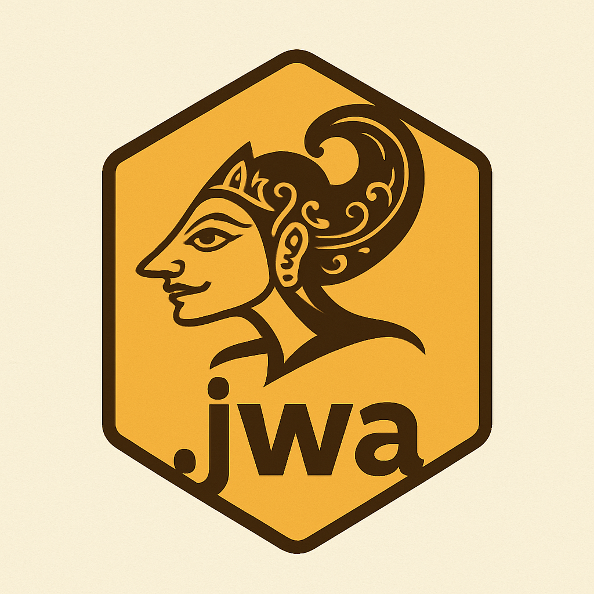

# ꦗꦮꦏꦿꦩ Jawakrama

<p align="center">
  
</p>

> **Bahasa Pemrograman Berbasis Jawa Krama (Jawa Alus)**
> *The Javanese Programming Language running on Node.js*

[](https://github.com/APTXmrnn/jawakrama-lang)
[](LICENSE)
[](https://nodejs.org/)
[](https://www.npmjs.com/package/jawakrama)
[](https://marketplace.visualstudio.com/items?itemName=novens.jawakrama-highlight)

**Jawakrama** adalah bahasa pemrograman yang dirancang untuk membawa nuansa budaya Jawa ke dalam dunia koding. Dengan menggunakan sintaksis **Basa Jawa Krama**, Jawakrama membuat pemrograman terasa lebih sopan, berbudaya, dan unik, sambil tetap mempertahankan kekuatan ekosistem JavaScript/Node.js.

---

## ✨ Fitur Utama (Features) - v1.0.0

- 🗣️ **Sintaksis Jawa Krama**: Menggunakan kata-kata seperti `damel`, `menawi`, `kagem` untuk koding.
- 🚀 **CLI Tool**: Perintah mudah `jawa init` dan `jawa <file>` untuk memulai.
- 🧩 **VS Code Extension (v1.0.0)**: Dukungan syntax highlighting, snippets, dan tombol Run.
- 🛑 **Error Localization**: Pesan error diterjemahkan ke Bahasa Jawa (contoh: *Kalepatan Referensi*).
- ⚡ **Shorthand Aliases**: Singkatan praktis (`mnw`, `kgm`, `sanes`) untuk koding lebih cepat.

## 📦 Instalasi (Installation)

Pastikan Anda sudah menginstall [Node.js](https://nodejs.org/).

### Via NPM (Recommended)
```bash
npm install -g jawakrama
```

### Via Source (Development)
```bash
# Clone repository ini
git clone https://github.com/APTXmrnn/jawakrama-lang.git

# Masuk ke folder
cd jawakrama-lang

# Install dependencies & Link CLI
npm install
npm link
```

## 🚀 Cara Menggunakan (Usage)

### 1. Membuat Proyek Baru
Buat proyek baru dengan struktur dasar secara otomatis:

```bash
jawa init proyek_anyar
cd proyek_anyar
```

### 2. Menjalankan Kode
Jalankan file `.jwa` Anda:

```bash
jawa main.jwa
# Atau gunakan alias:
mlyu main.jwa
```

## 📝 Contoh Kode (Example)

Berikut adalah contoh program **FizzBuzz** dalam Jawakrama:

```javascript
serat("--- FizzBuzz Jawakrama ---");

kagem (damel i = 1; i <= 15; i++) {
    menawi (i % 3 == 0 && i % 5 == 0) {
        serat("FizzBuzz");
    } sanes menawi (i % 3 == 0) {
        serat("Fizz");
    } sanes menawi (i % 5 == 0) {
        serat("Buzz");
    } sanesipun {
        serat(i);
    }
}
```

## 📚 Kamus Kata Kunci (Keywords)

| Jawakrama | Alias | JavaScript | Arti |
| :--- | :--- | :--- | :--- |
| `damel` | - | `let` | Membuat variabel |
| `tetep` | - | `const` | Konstanta |
| `karya` | - | `function` | Fungsi |
| `menawi` | `mnw` | `if` | Jika |
| `sanesipun` | `sanes` | `else` | Lainnya |
| `kagem` | `kgm` | `for` | Untuk (Loop) |
| `serat` | - | `console.log` | Cetak/Tulis |

> 📖 **Dokumentasi Lengkap**:
> - [Daftar Kata Kunci Lengkap (Keywords)](https://github.com/APTXmrnn/jawakrama-lang/blob/main/pustaka/docs/KEYWORDS.md)
> - [Panduan Penggunaan (Usage Guide)](https://github.com/APTXmrnn/jawakrama-lang/blob/main/pustaka/docs/USAGE.md)

## 🛠️ VS Code Extension

Untuk pengalaman terbaik, install ekstensi **Jawakrama Language Support** dari [VS Code Marketplace](https://marketplace.visualstudio.com/items?itemName=novens.jawakrama-highlight).

**Cara Install:**
1. Buka VS Code
2. Tekan `Ctrl+P` (atau `Cmd+P` di Mac)
3. Ketik: `ext install novens.jawakrama-highlight`
4. Tekan Enter

Ekstensi ini menyediakan:
- Syntax Highlighting 🎨
- Code Snippets ✂️
- Run Button ▶️

## 🤝 Kontribusi

Monggo! Kontribusi sangat diterima. Silakan buat *Pull Request* atau laporkan *Issue* jika menemukan *kalepatan* (kesalahan).

---

*Dibuat dengan ❤️ dan ☕ (kopi) untuk melestarikan budaya Jawa.*
